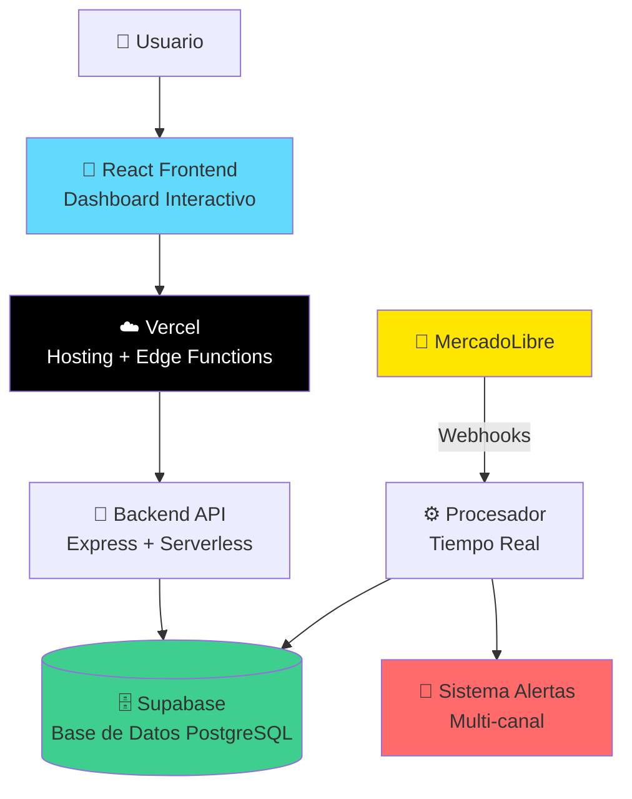
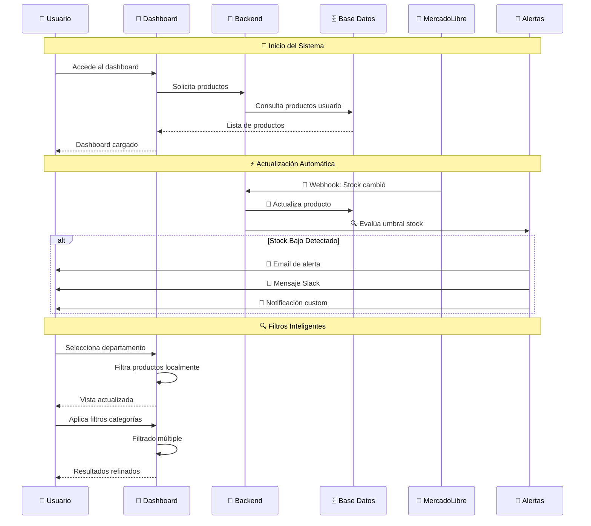
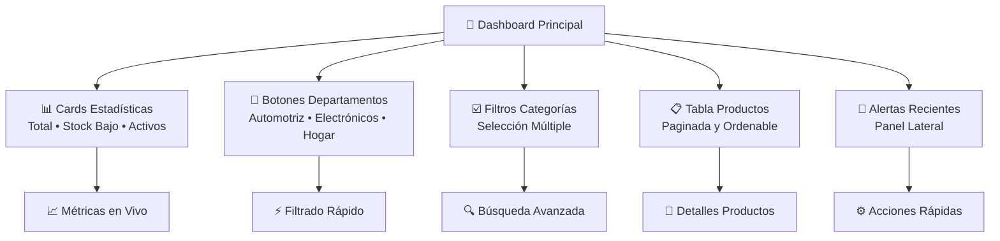
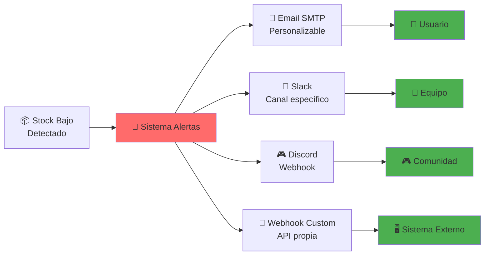
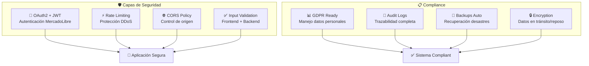
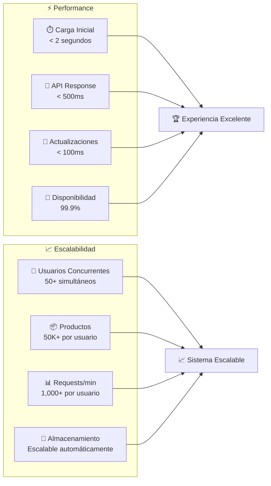

# 📦 Monitor de Stock Inteligente para MercadoLibre
## 🎯 Presentación Ejecutiva

---

## 🚀 **¿Qué es?**

Una **aplicación web moderna** que monitorea automáticamente el stock de productos de MercadoLibre con **alertas en tiempo real** y **filtros inteligentes avanzados**.

### ✨ **Características Clave**
- 🔄 **Actualizaciones instantáneas** vía webhooks de MercadoLibre
- 🏢 **Departamentos configurables** - Agrupa productos por categorías
- ☑️ **Filtros múltiples** - Selecciona varias categorías simultáneamente  
- 📧 **Alertas multi-canal** - Email, Slack, Discord, webhooks custom
- 📱 **Diseño responsive** - Funciona en móvil y desktop
- ⚡ **Arquitectura serverless** - Escalable y eficiente

---

## 🏗️ **Arquitectura del Sistema**



---

## 🔄 **Flujo de Información en Tiempo Real**



---

## 🎨 **Dashboard Inteligente**

### 📊 **Vista Principal**



### 🏢 **Sistema de Departamentos**

Los departamentos permiten agrupar productos por categorías relacionadas:

```javascript
// Ejemplo de configuración
{
  "Automotriz": ["Autos", "Repuestos", "Accesorios"],
  "Electrónicos": ["Celulares", "Computación", "Audio"],
  "Hogar": ["Muebles", "Decoración", "Electrodomésticos"]
}
```

---

## 📊 **Capacidades y Escalabilidad**

### 🆓 **Plan Gratuito** (Ideal para PyMEs)
| Métrica | Capacidad |
|---------|-----------|
| **👥 Usuarios** | 1,000-5,000/mes |
| **📦 Productos** | 10,000-50,000 por usuario |
| **⚡ Requests** | 100,000/mes |
| **🔄 Actualizaciones** | Tiempo real ilimitadas |
| **💰 Costo** | **$0/mes** |

### 🏢 **Plan Empresarial** ($45/mes)
| Métrica | Capacidad |
|---------|-----------|
| **👥 Usuarios** | 5-20 usuarios |
| **📦 Productos** | ~10,000 productos |
| **💾 Storage** | 8GB |
| **📊 Bandwidth** | 1TB/mes |
| **🎯 Beneficios** | Soporte prioritario + Métricas avanzadas |

### 🏭 **Plan Enterprise** ($1,000+/mes)
| Métrica | Capacidad |
|---------|-----------|
| **👥 Usuarios** | 20+ usuarios |
| **📦 Productos** | 100,000+ productos |
| **💾 Storage** | 200GB+ |
| **🛡️ SLA** | 99.9% uptime garantizado |
| **📞 Soporte** | 24/7 dedicado |

---

## 🔔 **Sistema de Alertas Multi-Canal**



### 📧 **Canales Disponibles**
- **Email:** SMTP configurable (Gmail, Outlook, custom)
- **Slack:** Integración directa con workspaces
- **Discord:** Webhooks para servidores
- **Custom:** APIs propias para integración

---

## ⚡ **Tecnologías Modernas**

### 🎨 **Frontend**
- **React 18** con hooks modernos
- **Bootstrap 5** responsive design
- **Vite** para desarrollo rápido
- **Context API** para estado global

### 🚀 **Backend**
- **Node.js + Express** API robusta
- **Vercel Serverless** funciones escalables
- **Supabase PostgreSQL** base de datos moderna
- **OAuth2** autenticación segura

### ☁️ **Infraestructura**
- **Vercel Edge Network** latencia global baja
- **Supabase Cloud** backups automáticos
- **9/12 Serverless Functions** dentro del límite
- **Webhooks en tiempo real** de MercadoLibre

---

## 🔒 **Seguridad y Compliance**



---

## 📈 **Ventajas Competitivas**

### ⚡ **Tiempo Real vs Competencia**
| Característica | Nuestra Solución | Competencia Típica |
|----------------|------------------|--------------------|
| **🔄 Actualizaciones** | Instantáneas (webhooks) | Cada 15-30 minutos |
| **🏢 Departamentos** | ✅ Configurables | ❌ No disponible |
| **☑️ Multi-categoría** | ✅ Filtros avanzados | ❌ Solo una categoría |
| **📱 Mobile** | ✅ Responsive nativo | ❌ Limitado |
| **💰 Costo inicial** | ✅ Gratis | ❌ Desde $50/mes |

### 🚀 **Beneficios del Negocio**
- **📉 Reduce stockouts** hasta 80%
- **⏰ Ahorra tiempo** 5+ horas/semana
- **📊 Mejora decisiones** con datos en tiempo real
- **🎯 Aumenta ventas** por mejor disponibilidad
- **💡 Escalable** desde 1 hasta 1000+ productos

---

## 🛠️ **Casos de Uso Reales**

### 🏪 **Pequeño Comerciante**
- **Productos:** 50-500 items
- **Uso:** Alertas básicas por email
- **Beneficio:** No más ventas perdidas por falta de stock
- **Plan:** Gratuito ($0/mes)

### 🏢 **Empresa Mediana**
- **Productos:** 1,000-10,000 items
- **Uso:** Departamentos + alertas Slack
- **Beneficio:** Gestión organizada por categorías
- **Plan:** Empresarial ($45/mes)

### 🏭 **Gran Distribuidor**
- **Productos:** 10,000+ items
- **Uso:** Multi-usuario + integraciones custom
- **Beneficio:** Automatización completa del inventario
- **Plan:** Enterprise ($1,000+/mes)

---

## 📊 **Métricas de Rendimiento**



---

## 🚀 **Próximos Pasos - Roadmap**

### 📅 **Q1 2024**
- [ ] 📱 **App móvil nativa** (React Native)
- [ ] 🌐 **Multi-idioma** (Español, Inglés, Portugués)
- [ ] 📊 **Dashboard analytics** avanzado

### 📅 **Q2 2024**
- [ ] 💬 **Integración WhatsApp** Business
- [ ] 🤖 **IA para predicción** de stock
- [ ] 📈 **Reportes automáticos** por email

### 📅 **Q3-Q4 2024**
- [ ] 🛒 **Multi-marketplace** (Amazon, eBay)
- [ ] 🔗 **API pública** para integraciones
- [ ] 🎯 **Machine Learning** para optimización

---

## 💼 **Propuesta de Valor**

### 🎯 **Para el Negocio**
- **ROI inmediato:** Reducción de pérdidas por stockouts
- **Eficiencia operativa:** Automatización del monitoreo
- **Escalabilidad:** Crece con tu negocio
- **Integración fácil:** Sin cambios en procesos actuales

### 👥 **Para el Usuario**
- **Interfaz intuitiva:** Fácil de usar desde el primer día
- **Alertas inteligentes:** Solo cuando realmente importa
- **Acceso móvil:** Monitorea desde cualquier lugar
- **Datos en tiempo real:** Decisiones informadas

### 💰 **Modelo de Negocio**
- **Freemium:** Comienza gratis, escala según necesidades
- **Sin setup fees:** Implementación inmediata
- **Soporte incluido:** Documentación completa + comunidad
- **Transparencia total:** Sin costos ocultos

---

## 📞 **Contacto y Demo**

### 🎮 **Demo en Vivo**
**🔗 [Ver Demo](https://tu-app.vercel.app)**
- Usuario demo disponible
- Datos de ejemplo incluidos
- Todas las funcionalidades activas

### 📧 **Contacto**
- **Email:** contacto@tuempresa.com
- **WhatsApp:** +52 1 55 1234 5678
- **LinkedIn:** /company/tu-empresa
- **GitHub:** /tu-usuario/mercado-libre-stock-monitor

### 📋 **Recursos**
- **📚 Documentación:** README.md completo
- **🔧 Documentación técnica:** TECHNICAL.md
- **🐛 Soporte:** GitHub Issues
- **💬 Comunidad:** Discord/Slack

---

## 🏆 **¿Por Qué Elegirnos?**

### ✅ **Ventajas Únicas**
- **🔄 Tiempo real verdadero** - No polling, webhooks nativos
- **🏢 Departamentos configurables** - Organización personalizada
- **☑️ Filtros múltiples** - Búsqueda avanzada intuitiva
- **💰 Plan gratuito robusto** - Funcionalidad completa sin costo
- **📱 Mobile-first** - Diseñado para dispositivos móviles
- **🔒 Seguridad enterprise** - Desde el primer día

### 🚀 **Listos para Escalar**
- **Arquitectura serverless** preparada para millones de requests
- **Base de datos PostgreSQL** con optimizaciones automáticas
- **CDN global** para latencia mínima mundial
- **Backups automáticos** y recuperación ante desastres

---

**⭐ ¡Comienza gratis hoy mismo y transforma tu gestión de inventario!**

**🔗 [Iniciar Demo](https://tu-app.vercel.app/login)** | **📞 [Agendar Llamada](mailto:contacto@tuempresa.com)** | **📖 [Documentación Completa](README.md)**