# 📋 Documentación Técnica - Monitor de Stock MercadoLibre

## 🏗️ Arquitectura del Sistema

### 📊 Diagrama de Arquitectura General

```mermaid
graph TB
    User[👤 Usuario] --> Frontend[🎨 React Frontend<br/>Vite + Bootstrap]
    Frontend --> Vercel[☁️ Vercel Edge Network]
    
    Vercel --> MainApp[🚀 Express App<br/>src/app.js]
    Vercel --> ServerlessAPI[⚡ Serverless Functions<br/>src/api/*]
    
    MainApp --> Supabase[(🗄️ Supabase<br/>PostgreSQL)]
    ServerlessAPI --> Supabase
    
    ML[🛒 MercadoLibre API] --> Webhooks[🔔 Webhooks<br/>/api/webhooks/ml]
    Webhooks --> WebhookProcessor[⚙️ Webhook Processor<br/>Real-time Updates]
    WebhookProcessor --> Supabase
    
    MainApp --> Alerts[📧 Sistema de Alertas<br/>Email/Slack/Discord]
    
    style Frontend fill:#61DAFB
    style Vercel fill:#000
    style Supabase fill:#3ECF8E
    style ML fill:#FFE600
    style Alerts fill:#FF6B6B
```

### 🔄 Flujo de Datos en Tiempo Real

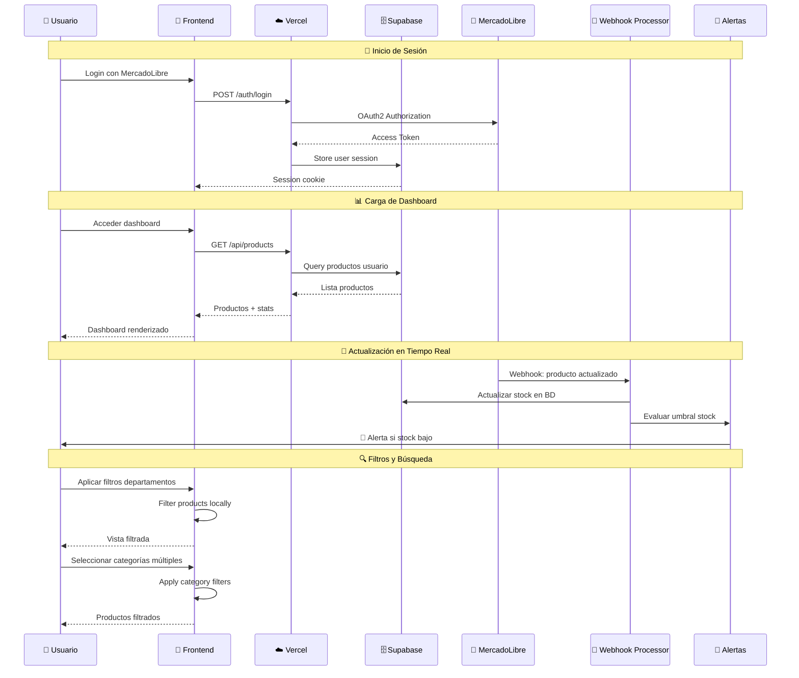

### ⚡ Arquitectura Serverless Functions

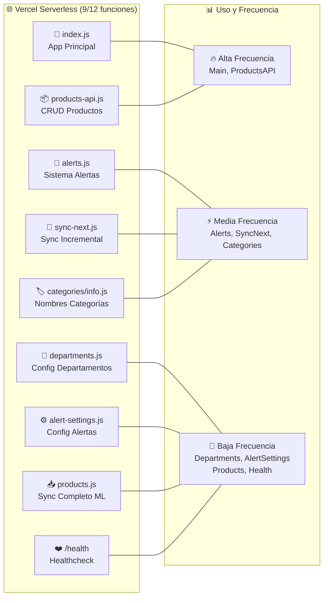

## 🗄️ Esquema de Base de Datos

### 📊 Diagrama de Entidades

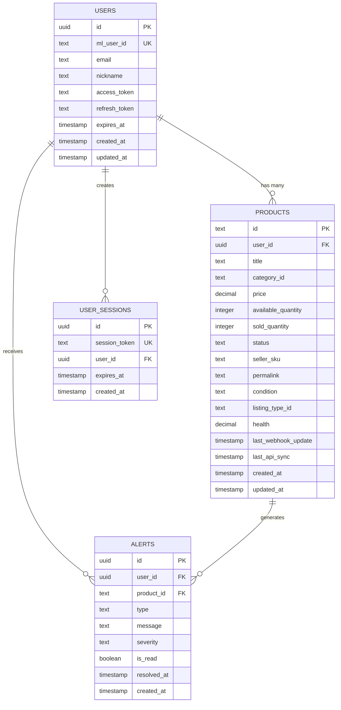

### 🔍 Índices de Performance

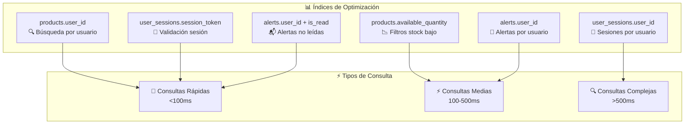

## 🔄 Sistema de Webhooks

### 📡 Procesamiento de Webhooks MercadoLibre

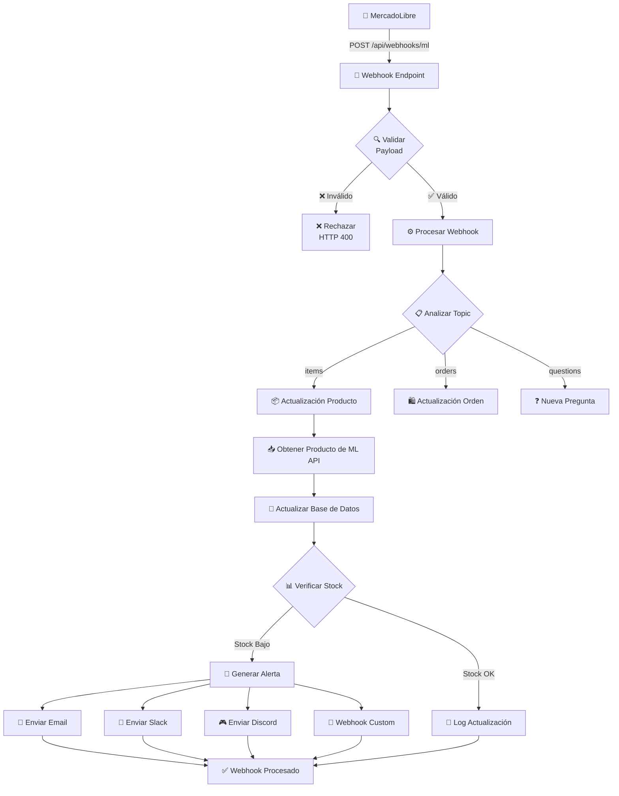

### 🔔 Flujo de Alertas Multi-Canal

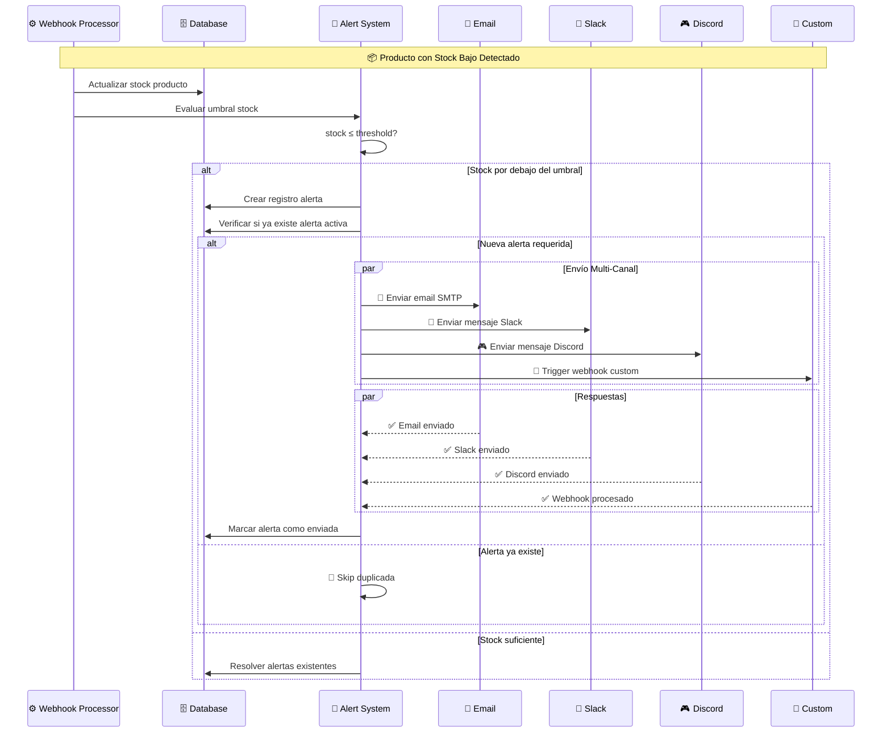

## 🎨 Arquitectura Frontend

### ⚛️ Estructura de Componentes React

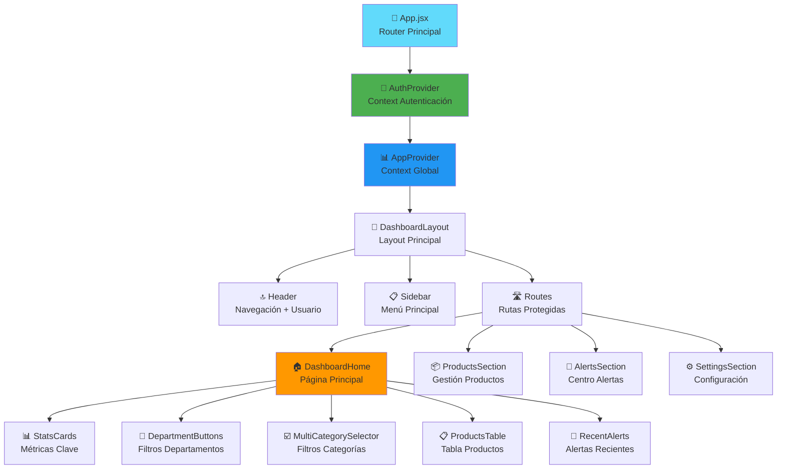

### 🔄 Gestión de Estado con Context API

```mermaid
graph LR
    subgraph "🔐 AuthContext"
        AuthState[👤 Estado Usuario<br/>isAuthenticated<br/>user<br/>loading]
        AuthActions[🔧 Acciones Auth<br/>login()<br/>logout()<br/>checkAuth()]
    end
    
    subgraph "📊 AppContext"
        AppState[📋 Estado Global<br/>products[]<br/>alerts[]<br/>stats{}<br/>loading{}]
        AppActions[⚙️ Acciones App<br/>setProducts()<br/>setAlerts()<br/>setLoading()]
    end
    
    subgraph "🎛️ Filtros State"
        DeptState[🏢 Departamentos<br/>config[]<br/>selectedDepartment]
        CategoryState[🏷️ Categorías<br/>selectedCategories[]<br/>availableCategories[]]
        FilterState[🔍 Filtros<br/>stockLevel<br/>searchText<br/>sortOrder]
    end
    
    AuthContext --> Components[⚛️ Componentes React]
    AppContext --> Components
    DeptState --> Components
    CategoryState --> Components
    FilterState --> Components
```

### 🎯 Custom Hooks

```mermaid
graph TD
    subgraph "🪝 Custom Hooks Especializados"
        useCategories[🏷️ useCategories<br/>- getCategoryName()<br/>- loadCategoryNames()<br/>- categoryCache]
        
        useDepartmentFilter[🏢 useDepartmentFilter<br/>- filteredProducts<br/>- departmentName<br/>- isFiltered]
        
        useAuth[🔐 useAuth<br/>- login()<br/>- logout()<br/>- checkAuthStatus()]
        
        useApi[🌐 useApi<br/>- get()<br/>- post()<br/>- handleErrors()]
        
        useLocalStorage[💾 useLocalStorage<br/>- getValue()<br/>- setValue()<br/>- removeValue()]
    end
    
    subgraph "📊 Datos y Estado"
        CategoryAPI[🏷️ Categories API<br/>categories/info]
        DepartmentConfig[🏢 Department Config<br/>Local Storage]
        AuthService[🔐 Auth Service<br/>API calls]
        APIService[🌐 API Service<br/>HTTP client]
        LocalStorage[💾 Browser Storage]
    end
    
    useCategories --> CategoryAPI
    useDepartmentFilter --> DepartmentConfig
    useAuth --> AuthService
    useApi --> APIService
    useLocalStorage --> LocalStorage
```

## 🔧 Sistema de Filtros Avanzado

### 🏢 Arquitectura de Departamentos

```mermaid
graph TB
    User[👤 Usuario] -->|Configura| DeptManager[🏢 Department Manager]
    
    DeptManager --> DeptConfig{📋 Configuración<br/>Departamentos}
    DeptConfig --> Storage[💾 Local Storage<br/>departments.config]
    
    Storage --> DeptButtons[🔘 Department Buttons<br/>UI Component]
    DeptButtons -->|Filtrar| ProductFilter[🔍 Product Filter]
    
    subgraph "📊 Ejemplo Configuración"
        Auto[🚗 Automotriz<br/>categories: [MLM1744, MLM1745]]
        Electronics[📱 Electrónicos<br/>categories: [MLM1000, MLM1001]]
        Home[🏠 Hogar<br/>categories: [MLM1574, MLM1575]]
    end
    
    DeptConfig --> Auto
    DeptConfig --> Electronics
    DeptConfig --> Home
    
    ProductFilter --> FilteredResults[📋 Productos Filtrados<br/>Por Departamento]
```

### ☑️ Sistema de Categorías Múltiples

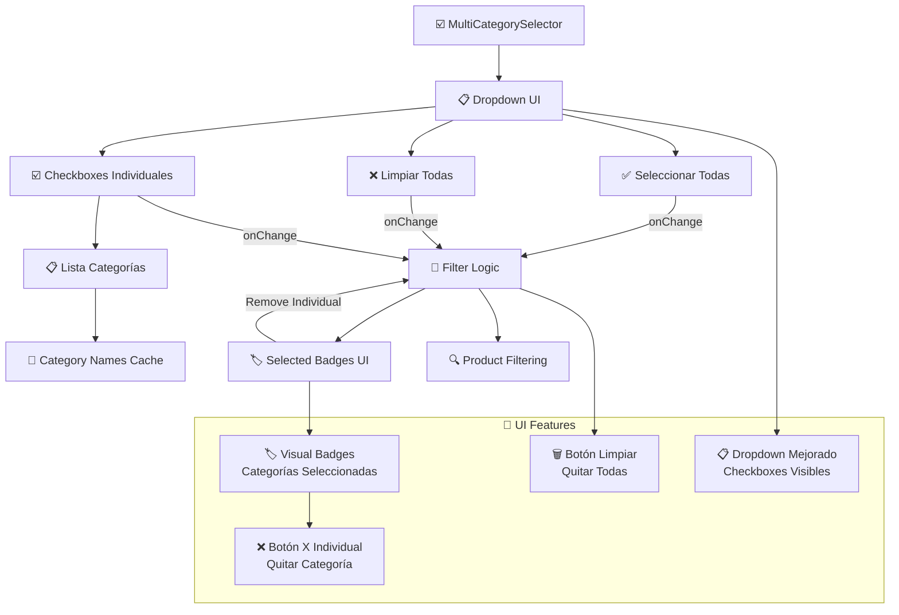

## 📊 Performance y Optimización

### ⚡ Estrategias de Performance

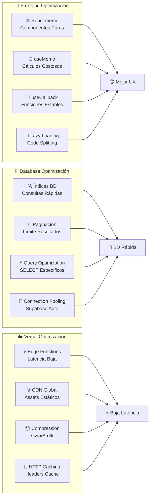

### 📈 Métricas de Performance

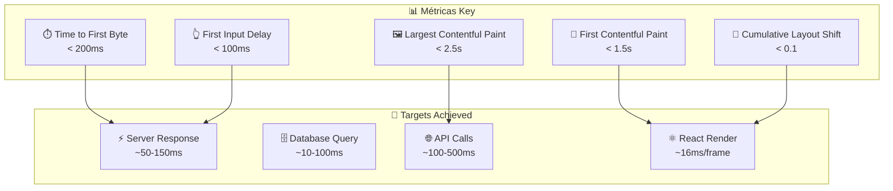

## 🔒 Seguridad y Compliance

### 🛡️ Medidas de Seguridad

```mermaid
graph TB
    subgraph "🔐 Autenticación"
        OAuth2[🔑 OAuth2 Flow<br/>MercadoLibre]
        JWT[🎫 JWT Tokens<br/>Secure Storage]
        Sessions[👤 User Sessions<br/>Database Stored]
        Expiration[⏰ Token Expiration<br/>Auto Refresh]
    end
    
    subgraph "🛡️ Protección API"
        RateLimit[⚡ Rate Limiting<br/>Request Throttling]
        CORS[🌐 CORS Policy<br/>Origin Control]
        Validation[✅ Input Validation<br/>Frontend + Backend]
        CSRF[🛡️ CSRF Protection<br/>Token Based]
    end
    
    subgraph "🔒 Data Security"
        Encryption[🔐 Data Encryption<br/>Transit + Rest]
        EnvVars[🔑 Environment Variables<br/>Secrets Management]
        Logs[📝 Secure Logging<br/>No Sensitive Data]
        Backup[💾 Database Backup<br/>Supabase Auto]
    end
    
    OAuth2 --> SecureApp[🏰 Aplicación Segura]
    JWT --> SecureApp
    Sessions --> SecureApp
    Expiration --> SecureApp
    
    RateLimit --> SecureApp
    CORS --> SecureApp
    Validation --> SecureApp
    CSRF --> SecureApp
    
    Encryption --> SecureApp
    EnvVars --> SecureApp
    Logs --> SecureApp
    Backup --> SecureApp
```

### 📋 Compliance y Regulaciones

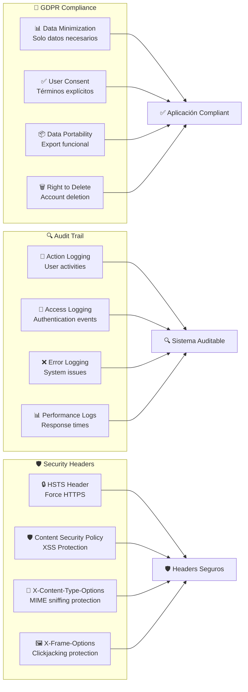

## 🧪 Testing y Quality Assurance

### 🔬 Estrategia de Testing

```mermaid
graph TD
    subgraph "🧪 Frontend Testing"
        UnitTests[⚛️ Unit Tests<br/>Jest + React Testing Library]
        ComponentTests[🧩 Component Tests<br/>Render + Interactions]
        HookTests[🪝 Hook Tests<br/>Custom hooks testing]
        IntegrationTests[🔗 Integration Tests<br/>API interactions]
    end
    
    subgraph "🔧 Backend Testing"
        APITests[🌐 API Tests<br/>Endpoint testing]
        ServiceTests[⚙️ Service Tests<br/>Business logic]
        DatabaseTests[🗄️ Database Tests<br/>Query validation]
        WebhookTests[🔔 Webhook Tests<br/>Event processing]
    end
    
    subgraph "🌐 E2E Testing"
        CypressTests[🤖 Cypress Tests<br/>User workflows]
        VisualTests[👁️ Visual Tests<br/>Screenshot comparison]
        PerformanceTests[⚡ Performance Tests<br/>Load testing]
        SecurityTests[🔒 Security Tests<br/>Vulnerability scanning]
    end
    
    UnitTests --> CI[🔄 CI Pipeline]
    ComponentTests --> CI
    HookTests --> CI
    IntegrationTests --> CI
    
    APITests --> CI
    ServiceTests --> CI
    DatabaseTests --> CI
    WebhookTests --> CI
    
    CypressTests --> CD[🚀 CD Pipeline]
    VisualTests --> CD
    PerformanceTests --> CD
    SecurityTests --> CD
```

### 📊 Quality Metrics

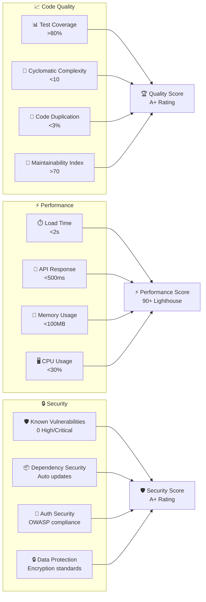

## 🚀 Deployment y DevOps

### 🔄 CI/CD Pipeline

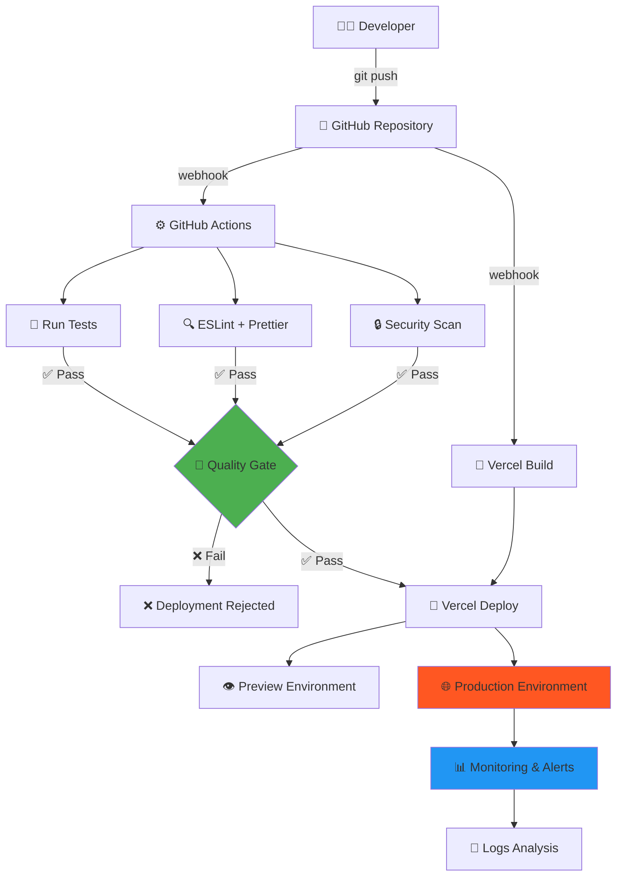

### 🌍 Entornos de Deployment

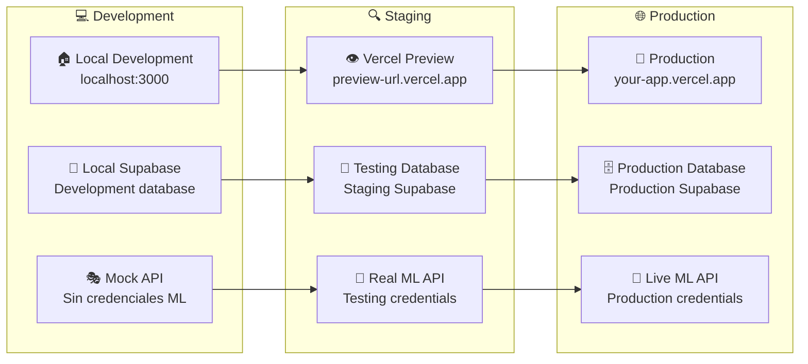

## 📊 Monitoring y Observabilidad

### 📈 Sistema de Monitoreo

```mermaid
graph TB
    subgraph "📊 Métricas de Aplicación"
        UserMetrics[👥 User Metrics<br/>Active users, sessions]
        ProductMetrics[📦 Product Metrics<br/>Products monitored, updates]
        AlertMetrics[🔔 Alert Metrics<br/>Alerts sent, response time]
        PerformanceMetrics[⚡ Performance Metrics<br/>Response time, uptime]
    end
    
    subgraph "🔍 Logging"
        AppLogs[📝 Application Logs<br/>Structured JSON logs]
        ErrorLogs[❌ Error Logs<br/>Exceptions, stack traces]
        AccessLogs[🔐 Access Logs<br/>Authentication, API calls]
        WebhookLogs[🔔 Webhook Logs<br/>ML webhook processing]
    end
    
    subgraph "🚨 Alerting"
        HealthChecks[❤️ Health Checks<br/>Service availability]
        ErrorRates[📈 Error Rate Alerts<br/>High error thresholds]
        PerformanceAlerts[⚡ Performance Alerts<br/>Slow response times]
        BusinessAlerts[💼 Business Alerts<br/>Stock alerts, sync issues]
    end
    
    UserMetrics --> Dashboard[📊 Monitoring Dashboard]
    ProductMetrics --> Dashboard
    AlertMetrics --> Dashboard
    PerformanceMetrics --> Dashboard
    
    AppLogs --> LogAnalysis[🔍 Log Analysis]
    ErrorLogs --> LogAnalysis
    AccessLogs --> LogAnalysis
    WebhookLogs --> LogAnalysis
    
    HealthChecks --> NotificationSystem[📧 Notification System]
    ErrorRates --> NotificationSystem
    PerformanceAlerts --> NotificationSystem
    BusinessAlerts --> NotificationSystem
```

## 📋 Conclusión

Esta documentación técnica proporciona una visión completa de la arquitectura, componentes, y flujos de datos del Monitor de Stock para MercadoLibre. El sistema está diseñado para ser:

- **🏗️ Escalable:** Arquitectura serverless que crece con la demanda
- **⚡ Performante:** Optimizaciones en frontend, backend y base de datos
- **🔒 Seguro:** Implementación de mejores prácticas de seguridad
- **📊 Observable:** Monitoreo completo y logging estructurado
- **🧪 Testeable:** Cobertura de tests en todos los niveles
- **🚀 Deployable:** CI/CD automatizado con quality gates

El sistema actual maneja eficientemente las necesidades de pequeñas a medianas empresas, con un claro camino de escalabilidad para organizaciones más grandes mediante la actualización a planes pagos de Vercel y Supabase.

---

**📖 [Volver al README](README.md)** | **🎯 [Ver Roadmap](ROADMAP.md)**