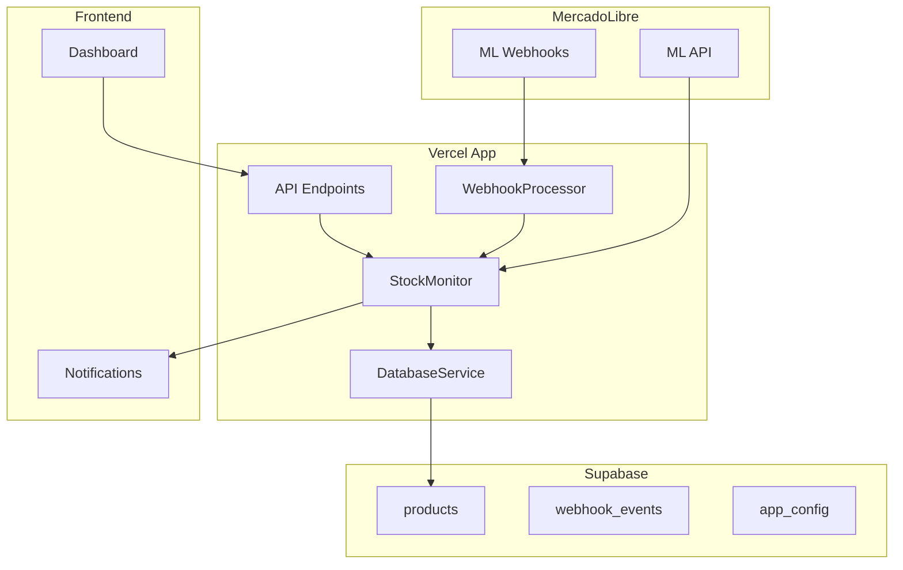
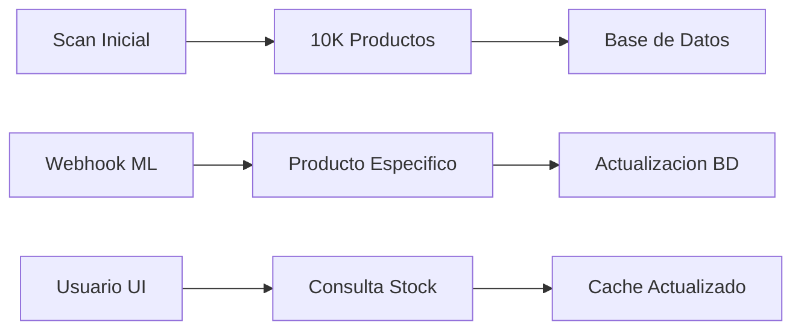
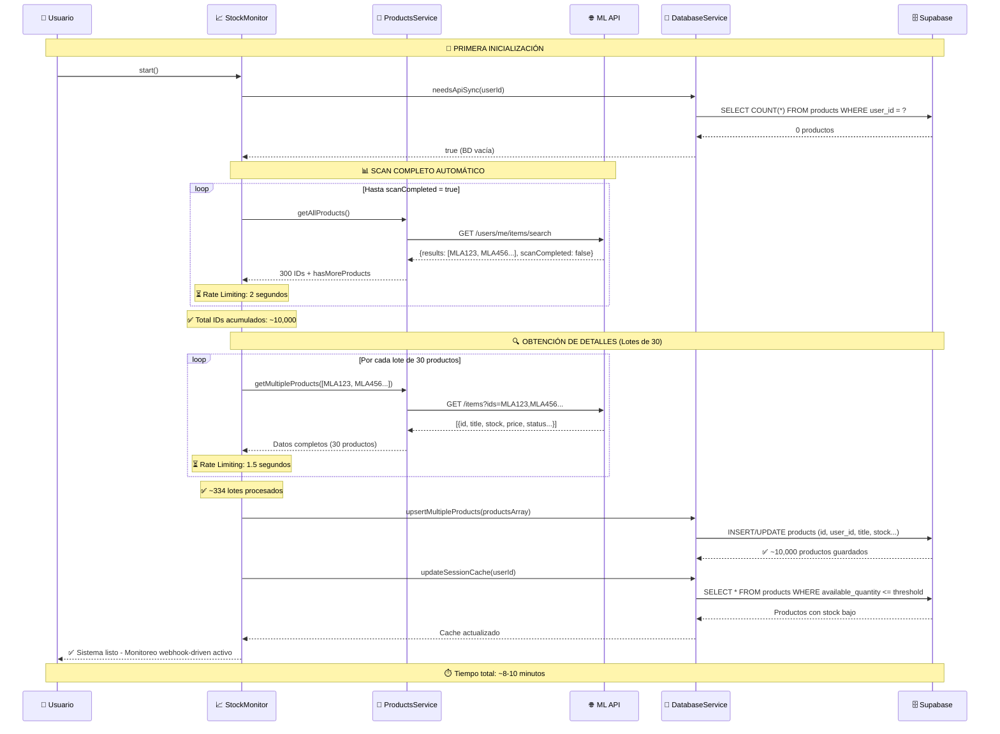
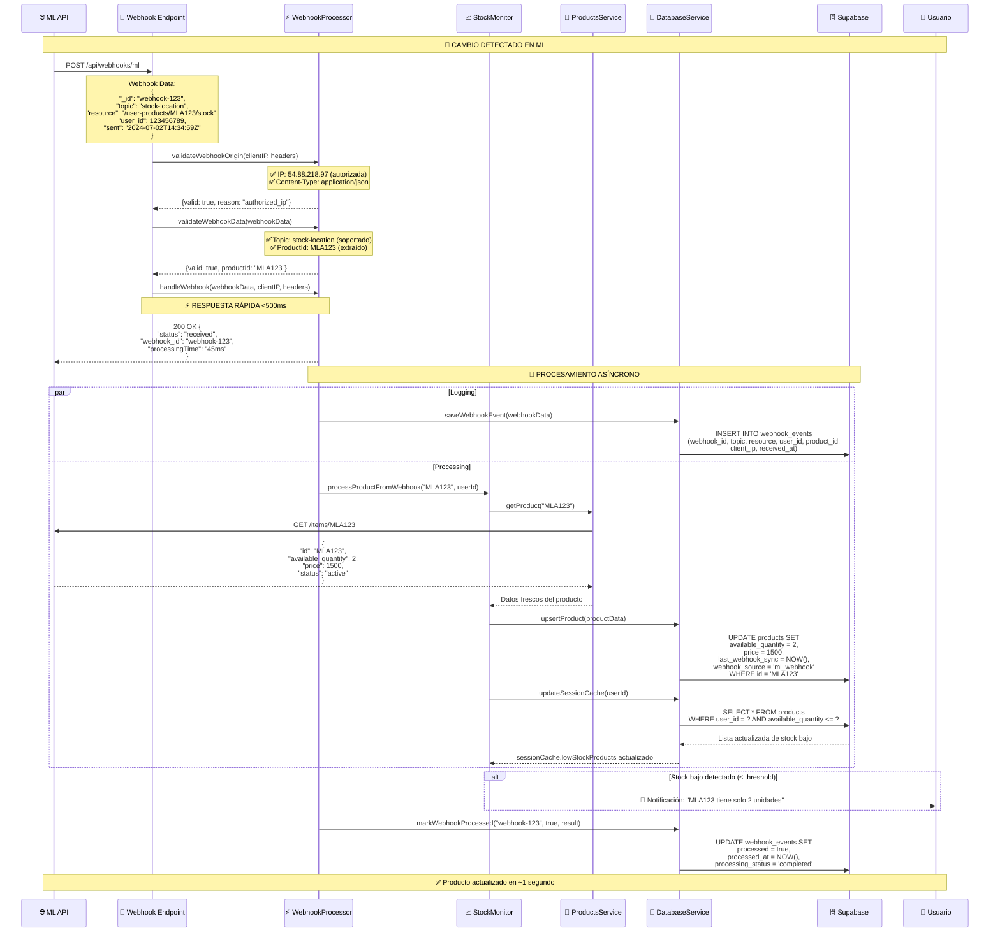
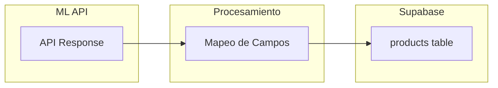
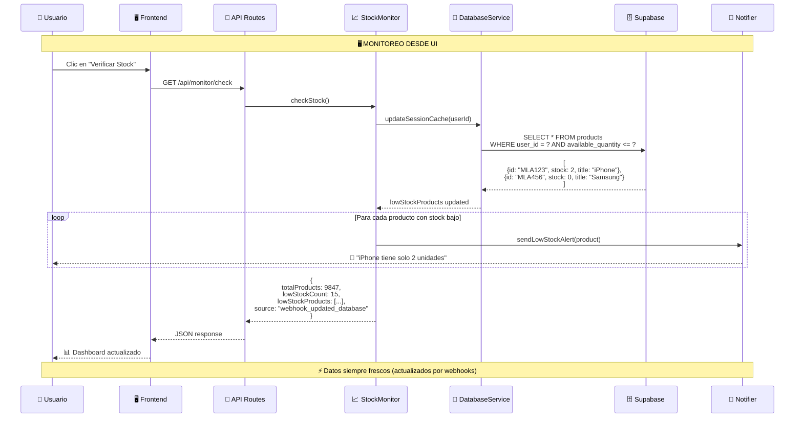

# 🚀 Sistema de Monitoreo de Stock MercadoLibre
## Arquitectura Webhook-Driven con Supabase - Documentación Técnica Completa

---

## 📋 **Resumen Ejecutivo**

El sistema migró de una arquitectura basada en **polling manual** a una arquitectura **webhook-driven** con persistencia en Supabase. Esta migración elimina el 99% de las llamadas innecesarias a ML API y proporciona actualizaciones en tiempo real.

### **🎯 Beneficios Clave**
- ⚡ **Tiempo real**: Actualizaciones instantáneas vía webhooks
- 💰 **Eficiencia**: 99% menos llamadas a ML API después del scan inicial
- 🛡️ **Robustez**: Persistencia que sobrevive restarts de Vercel
- 📈 **Escalabilidad**: Optimizado para 10,000+ productos

---

## 🏗️ **Arquitectura General del Sistema**

### **📊 Componentes Principales**



### **🔄 Flujos de Datos Detallados**



---

## 🔄 **Flujo de Inicialización Completa**

### **Primera Vez - Scan Automático de ~10,000 Productos**



### **📊 Desglose del Scan Inicial**

| Fase | Operación | Tiempo | Detalles |
|------|-----------|--------|----------|
| 🔍 **Obtención de IDs** | `getAllProducts()` en loop | ~2 minutos | ~34 lotes de 300 IDs c/u |
| 📦 **Detalles de productos** | `getMultipleProducts()` | ~8 minutos | ~334 lotes de 30 productos c/u |
| 💾 **Guardado en BD** | `upsertMultipleProducts()` | ~30 segundos | Batch insert optimizado |
| 🔄 **Actualización cache** | `updateSessionCache()` | ~5 segundos | Query de productos con stock bajo |

### **🔗 Campos Procesados en Inicialización**

| Campo ML API | Procesamiento | Destino BD | Ejemplo |
|-------------|---------------|------------|---------|
| `id` | Directo | `id (PK)` | `MLA123456789` |
| `title` | Directo | `title` | `iPhone 14 Pro 128GB` |
| `seller_sku` | Extracción inteligente | `seller_sku` | `IP14-PRO-128` |
| `available_quantity` | `\|\| 0` fallback | `available_quantity` | `5` |
| `price` | Directo | `price` | `850000.00` |
| `status` | Directo | `status` | `active` |
| `permalink` | Directo | `permalink` | `https://articulo.mercadolibre...` |
| `category_id` | Directo | `category_id` | `MLA1055` |
| `condition` | Directo | `condition` | `new` |
| `listing_type_id` | Directo | `listing_type_id` | `gold_special` |
| `health` | Directo | `health` | `good` |
| - | Generated | `user_id` | `user_12345` |
| - | `NOW()` | `last_api_sync` | `2024-07-02T14:30:00Z` |

---

## ⚡ **Flujo de Webhooks - Tiempo Real**

### **Actualización Individual por Evento ML**



### **🔔 Tipos de Webhooks Manejados**

#### **📦 Stock-Location Webhook**
```json
{
  "_id": "webhook-stock-123",
  "topic": "stock-location",
  "resource": "/user-products/MLA123456789/stock",
  "user_id": 123456789,
  "application_id": 213123389095511,
  "sent": "2024-07-02T14:34:59Z",
  "attempts": 1,
  "received": "2024-07-02T14:35:00Z"
}
```
**→ Actualiza:** `available_quantity` del producto específico

#### **📋 Items Webhook**
```json
{
  "_id": "webhook-items-456", 
  "topic": "items",
  "resource": "/items/MLA123456789",
  "user_id": 123456789,
  "application_id": 213123389095511,
  "sent": "2024-07-02T14:34:59Z",
  "attempts": 1,
  "received": "2024-07-02T14:35:00Z"
}
```
**→ Actualiza:** Todos los datos del producto (precio, título, estado, etc.)

### **🛡️ Validación de Webhooks**

| Validación | Criterio | Acción si Falla |
|------------|----------|-----------------|
| **IP Address** | Lista autorizada de ML | HTTP 403 Forbidden |
| **Content-Type** | `application/json` | HTTP 400 Bad Request |
| **Estructura** | Campos requeridos presentes | HTTP 400 Bad Request |
| **Topic** | `stock-location` o `items` | HTTP 400 Bad Request |
| **Product ID** | Extraíble del resource | HTTP 400 Bad Request |

#### **🔐 IPs Autorizadas de MercadoLibre**
```javascript
const allowedIPs = [
  '54.88.218.97',
  '18.215.140.160', 
  '18.213.114.129',
  '18.206.34.84'
];
```

---

## 📊 **Mapeo Completo de Datos**

### **🔄 Transformación ML API → Supabase**



### **📋 Mapeo Detallado de Campos**

| Campo ML API | → | Campo Supabase | Ejemplo |
|-------------|---|----------------|---------|
| `id` | → | `id (PK)` | `MLA123456789` |
| `title` | → | `title` | `iPhone 14 Pro` |
| `available_quantity` | → | `available_quantity` | `5` |
| `price` | → | `price` | `850000.00` |
| `status` | → | `status` | `active` |
| - | → | `user_id` | `user_12345` (generado) |
| - | → | `last_api_sync` | `NOW()` (timestamp) |

**❌ Campos NO persistidos:** `currency_id`, `thumbnail`, `date_created`

### **💾 Cache de Sesión (Estructura en Memoria)**

El sistema mantiene un cache optimizado para respuestas rápidas de UI:

```javascript
// sessionCache - Estructura optimizada para UI
{
  lowStockProducts: [
    {
      id: "MLA123456789",                    // products.id
      title: "iPhone 14 Pro 128GB",         // products.title  
      seller_sku: "IP14-PRO-128",           // products.seller_sku
      stock: 2,                             // products.available_quantity (renombrado)
      status: "active",                     // products.status
      permalink: "https://articulo...",     // products.permalink
      productUrl: "https://articulo...",    // permalink o generado
      lastUpdated: "2024-07-02T14:35:00Z"   // products.updated_at (renombrado)
    }
  ],
  totalProducts: 9847,                     // COUNT(*) WHERE status='active'
  lastScanInfo: {
    lastSync: "2024-07-02T14:30:00Z",      // Último sync completo
    source: "webhook_updated_database"      // Fuente de los datos
  }
}
```

---

## 🗄️ **Esquema Completo de Base de Datos**

### **📦 Tabla Principal: products**

```sql
CREATE TABLE products (
    -- 🔑 Identificadores
    id                TEXT PRIMARY KEY,           -- 'MLA123456789'
    user_id           TEXT NOT NULL,              -- 'user_12345'
    
    -- 📋 Información del Producto
    title             TEXT,                       -- 'iPhone 14 Pro 128GB'
    seller_sku        TEXT,                       -- 'IP14-PRO-128'
    category_id       TEXT,                       -- 'MLA1055'
    condition         TEXT,                       -- 'new' | 'used'
    listing_type_id   TEXT,                       -- 'gold_special' | 'bronze'
    
    -- 💰 Información Comercial
    available_quantity INTEGER DEFAULT 0,         -- 5
    price             DECIMAL(15,2),              -- 850000.00
    status            TEXT,                       -- 'active' | 'paused' | 'closed'
    health            TEXT,                       -- 'good' | 'bad' | 'warning'
    
    -- 🔗 Enlaces
    permalink         TEXT,                       -- 'https://articulo.mercadolibre.com.ar/...'
    
    -- ⏰ Metadatos de Sincronización
    last_api_sync     TIMESTAMP,                  -- '2024-07-02 14:30:00'
    last_webhook_sync TIMESTAMP,                  -- '2024-07-02 14:35:00'
    webhook_source    TEXT,                       -- 'ml_webhook'
    updated_at        TIMESTAMP DEFAULT NOW(),    -- Auto-timestamp
    created_at        TIMESTAMP DEFAULT NOW(),    -- Auto-timestamp
    
    -- 📊 Índices para Performance
    INDEX idx_user_stock (user_id, available_quantity),
    INDEX idx_user_status (user_id, status),
    INDEX idx_last_sync (last_api_sync),
    INDEX idx_webhook_sync (last_webhook_sync)
);
```

### **🔔 Tabla de Eventos: webhook_events**

```sql
CREATE TABLE webhook_events (
    -- 🔑 Identificador
    id                    SERIAL PRIMARY KEY,
    webhook_id            TEXT UNIQUE NOT NULL,   -- 'webhook-123-456'
    
    -- 📨 Datos del Webhook
    topic                 TEXT NOT NULL,          -- 'stock-location' | 'items'
    resource              TEXT NOT NULL,          -- '/user-products/MLA123/stock'
    user_id               INTEGER NOT NULL,       -- 123456789
    product_id            TEXT,                   -- 'MLA123456789' (extraído del resource)
    
    -- 🔄 Estado de Procesamiento
    processed             BOOLEAN DEFAULT FALSE,  -- true | false
    processing_status     TEXT,                   -- 'completed' | 'failed' | 'pending'
    processing_result     JSONB,                  -- {"updated": true, "stock": 5}
    attempts              INTEGER DEFAULT 1,      -- 1, 2, 3...
    
    -- ⏰ Timestamps
    received_at           TIMESTAMP DEFAULT NOW(),-- Cuando lo recibimos
    processed_at          TIMESTAMP,              -- Cuando terminamos de procesarlo
    sent_at               TIMESTAMP,              -- Cuando ML lo envió
    webhook_received_at   TIMESTAMP,              -- Timestamp interno del webhook
    
    -- 🌐 Metadatos de Red
    client_ip             TEXT,                   -- '54.88.218.97'
    request_headers       JSONB,                  -- {"content-type": "application/json"}
    
    -- 📊 Índices
    INDEX idx_processed (processed),
    INDEX idx_product_id (product_id),
    INDEX idx_received_at (received_at),
    INDEX idx_webhook_id (webhook_id)
);
```

### **⚙️ Tabla de Configuración: app_config**

```sql
CREATE TABLE app_config (
    key        TEXT PRIMARY KEY,                  -- 'stock_threshold' | 'auto_scan_interval'
    value      TEXT,                              -- '5' | '60'
    updated_at TIMESTAMP DEFAULT NOW()            -- Auto-timestamp
);

-- 📊 Configuraciones por Defecto
INSERT INTO app_config (key, value) VALUES 
('stock_threshold', '5'),           -- Umbral de stock bajo
('auto_scan_interval', '60'),       -- Minutos entre scans (no usado en webhook mode)
('webhook_retry_attempts', '3'),    -- Intentos de retry para webhooks
('cache_ttl_minutes', '5');         -- TTL del cache de sesión
```

---

## 🎯 **Operaciones Críticas de Base de Datos**

### **📊 Consultas de Alto Rendimiento**

#### **1. 🔍 Obtener Productos con Stock Bajo**
```sql
-- Usada en: updateSessionCache(), checkStock()
-- Frecuencia: Cada webhook + UI requests
-- Performance: <100ms para 10K productos

SELECT 
    id, 
    title, 
    seller_sku, 
    available_quantity, 
    permalink, 
    updated_at
FROM products 
WHERE user_id = $1 
    AND available_quantity <= $2 
    AND status = 'active'
ORDER BY available_quantity ASC, updated_at DESC
LIMIT 100;
```

#### **2. 📦 Upsert Masivo de Productos**
```sql
-- Usada en: syncProductsWithAPI() - Scan inicial
-- Frecuencia: Solo primera vez
-- Performance: ~30 segundos para 10K productos

INSERT INTO products (
    id, user_id, title, seller_sku, available_quantity, 
    price, status, permalink, category_id, condition, 
    listing_type_id, health, last_api_sync
) VALUES ($1, $2, $3, $4, $5, $6, $7, $8, $9, $10, $11, $12, $13)
ON CONFLICT (id) 
DO UPDATE SET 
    title = EXCLUDED.title,
    seller_sku = EXCLUDED.seller_sku,
    available_quantity = EXCLUDED.available_quantity,
    price = EXCLUDED.price,
    status = EXCLUDED.status,
    permalink = EXCLUDED.permalink,
    category_id = EXCLUDED.category_id,
    condition = EXCLUDED.condition,
    listing_type_id = EXCLUDED.listing_type_id,
    health = EXCLUDED.health,
    last_api_sync = EXCLUDED.last_api_sync,
    updated_at = NOW();
```

#### **3. ⚡ Upsert Individual por Webhook**
```sql
-- Usada en: processProductFromWebhook()
-- Frecuencia: Cada webhook (tiempo real)
-- Performance: <50ms por producto

INSERT INTO products (
    id, user_id, title, seller_sku, available_quantity, 
    price, status, permalink, category_id, condition, 
    listing_type_id, health, last_webhook_sync, webhook_source
) VALUES ($1, $2, $3, $4, $5, $6, $7, $8, $9, $10, $11, $12, NOW(), 'ml_webhook')
ON CONFLICT (id) 
DO UPDATE SET 
    title = EXCLUDED.title,
    available_quantity = EXCLUDED.available_quantity,
    price = EXCLUDED.price,
    status = EXCLUDED.status,
    last_webhook_sync = NOW(),
    webhook_source = 'ml_webhook',
    updated_at = NOW();
```

---

## 🔄 **Flujo Completo de Monitoreo desde UI**

### **📱 Interacción Usuario → Sistema**



---

## 📈 **Métricas de Performance y Escalabilidad**

### **⏱️ Tiempos de Respuesta Esperados**

| Operación | Frecuencia | Tiempo Objetivo | Observaciones |
|-----------|------------|-----------------|---------------|
| 🚀 **Scan inicial completo** | 1 vez al setup | ~8-10 minutos | 10,000 productos con rate limiting |
| 🔔 **Webhook processing** | Tiempo real | <500ms | Requisito crítico de ML |
| 📊 **Stock check (UI)** | On-demand | <1 segundo | Lectura desde cache |
| 💾 **Cache update** | Cada webhook | <200ms | Solo productos afectados |
| 🔍 **Low stock query** | UI request | <100ms | Índice optimizado |
| 📦 **Single product update** | Por webhook | <50ms | Upsert individual |

### **🛡️ Rate Limiting Implementado**

| Componente | Límite | Razón | Configuración |
|------------|--------|-------|---------------|
| **📊 Scan de IDs** | 2s entre lotes | Evitar 429 de ML API | `await sleep(2000)` |
| **🔍 Detalles de productos** | 1.5s entre lotes de 30 | Rate limit de ML | `await sleep(1500)` |
| **❌ Recovery de errores** | 5s pausa extra | Tiempo de recuperación | En catch blocks |
| **🔔 Webhooks individuales** | Sin límite | 1 producto por request | Sin pausa necesaria |

### **📊 Capacidad y Límites**

| Métrica | Valor Actual | Límite Técnico | Plan de Escalado |
|---------|--------------|----------------|------------------|
| **Productos por usuario** | ~10,000 | 50,000 | Paginación + índices |
| **Webhooks por minuto** | Ilimitado | ~1,000 | Batch processing |
| **Usuarios concurrentes** | 10-50 | 500 | Connection pooling |
| **Storage Supabase** | ~50MB | 500MB (free) | Plan Pro si necesario |
| **API calls ML/hora** | ~2,000 | 10,000 | Rate limiting adaptativo |

---

## 🛠️ **Configuración de Producción**

### **🌍 Variables de Entorno Críticas**

```bash
# 🗄️ Base de Datos
SUPABASE_URL=https://xxx.supabase.co
SUPABASE_ANON_KEY=eyJhbGc...
SUPABASE_SERVICE_ROLE_KEY=eyJhbGc...  # Para operaciones del servidor

# 🔐 MercadoLibre API
MOCK_ML_API=false                     # ¡CRÍTICO: false en producción!
ML_CLIENT_ID=123456789
ML_CLIENT_SECRET=xyz...

# ⚙️ Sistema
NODE_ENV=production
PORT=3000

# 📊 Monitoreo (Opcional)
STOCK_THRESHOLD=5                     # Override del threshold por defecto
LOG_LEVEL=info                        # debug | info | warn | error
```

### **🔧 Configuración ML Panel**

```json
{
  "webhook_url": "https://tu-app.vercel.app/api/webhooks/ml",
  "topics": [
    "stock-location",
    "items"
  ],
  "events": [
    "created", 
    "updated"
  ]
}
```

### **📋 Checklist de Deploy**

- [ ] ✅ `MOCK_ML_API=false` en producción
- [ ] ✅ Supabase credentials configurados
- [ ] ✅ Tablas creadas en Supabase con índices
- [ ] ✅ Webhook URL actualizada en ML panel
- [ ] ✅ Rate limiting configurado correctamente
- [ ] ✅ Logs y monitoreo activos
- [ ] ✅ Notificaciones configuradas
- [ ] ✅ Cache TTL optimizado
- [ ] ✅ Connection pooling habilitado

---

## 🎉 **Beneficios de la Arquitectura Webhook-Driven**

### **⚡ Performance**
- **99% menos** llamadas a ML API después del scan inicial
- **Tiempo real** en actualizaciones de stock
- **<500ms** tiempo de respuesta para webhooks
- **Cache inteligente** para consultas frecuentes

### **💰 Eficiencia de Costos**
- **Mínimas API calls** = menos rate limiting
- **Escalabilidad** sin aumentar costos ML API
- **Plan gratuito** Supabase suficiente para 10K productos
- **Vercel Hobby** plan suficiente para el tráfico

### **🛡️ Robustez**
- **Persistencia** sobrevive restarts de Vercel
- **Logging completo** de eventos para debugging
- **Retry logic** en caso de errores
- **Validación estricta** de webhooks
- **Connection pooling** para alta concurrencia

### **🔄 Mantenibilidad**
- **Separación clara** de responsabilidades
- **Código modular** y testeable
- **Documentación** completa del flujo
- **Monitoreo** integrado para troubleshooting
- **Rate limiting** configurable

---

**🎯 Sistema Webhook-Driven Completamente Optimizado**  
*✅ ~10,000 productos • ⚡ Tiempo real • 💾 Persistente • 🛡️ Rate limiting • 🔔 Event-driven • 📊 Monitoreo completo*

---

*Documentación técnica v1.0 - Sistema de Monitoreo de Stock MercadoLibre*  
*Arquitectura diseñada para producción con escalabilidad y robustez empresarial*